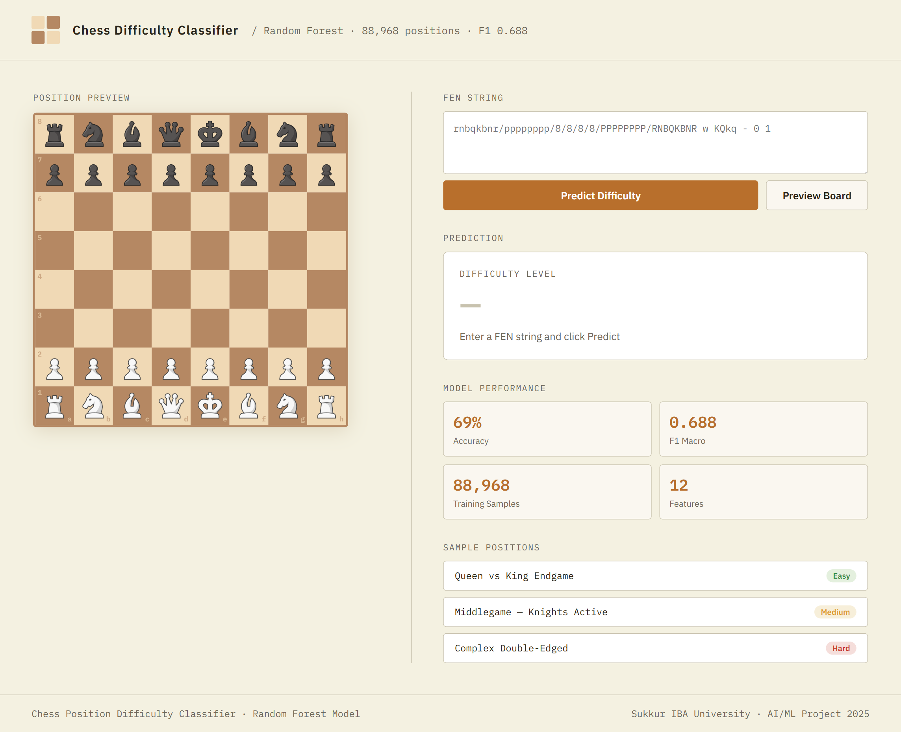

# Chess Position Difficulty Classifier

An AI/ML application that classifies chess positions into **Easy**, **Medium**, or **Hard** difficulty levels using a trained Random Forest model and 12 handcrafted positional features.

## Web Interface



A clean web interface built with Flask allows users to:
- Input any FEN string and get an instant difficulty prediction
- Preview the board position visually
- Try sample positions across all difficulty levels

## Model Performance

| Model | Accuracy | F1 Macro |
|---|---|---|
| Random Forest ✓ | 69.06% | 0.6881 |
| LightGBM | 67.58% | 0.6729 |
| KNN | 66.41% | 0.6615 |
| Decision Tree | 61.71% | 0.6192 |

**Dataset:** 88,968 chess positions with balanced class distribution (Easy / Medium / Hard)

## Features Used (12 total)

| Feature | Importance |
|---|---|
| material_diff | 0.1789 |
| game_phase | 0.1742 |
| weighted_mobility | 0.1476 |
| mobility | 0.1140 |
| attacked_pieces | 0.0923 |
| center_control | 0.0802 |
| king_safety | 0.0586 |
| pawn_structure | 0.0504 |
| open_file_rooks | 0.0443 |
| passed_pawns | 0.0322 |
| bishop_pair | 0.0232 |
| king_in_check | 0.0041 |

## Project Structure

```
chess-classifier/
├── app.py                  # Flask web application
├── main.py                 # Training pipeline (CLI)
├── model.py                # Model training, evaluation, saving
├── features.py             # Feature extraction from board
├── utils.py                # Chess utility functions
├── prepare_dataset.py      # Dataset labeling pipeline
├── analyze_data.py         # Data visualization
├── chess_dataset.csv       # Raw dataset (FEN + eval)
├── templates/
│   └── index.html          # Web UI
└── requirements.txt
```

## Setup & Run

### 1. Install dependencies
```bash
pip install -r requirements.txt
```

### 2. Train the model
```bash
python main.py --mode train --csv chess_dataset.csv
```
This generates `model.pkl` and `scaler.pkl`.

### 3. Run the web app
```bash
python app.py
```
Open `http://localhost:5000`

### 4. Predict from command line
```bash
# Single FEN
python main.py --mode predict --fen "rnbqkbnr/pppppppp/8/8/4P3/8/PPPP1PPP/RNBQKBNR b KQkq e3 0 1"

# Interactive mode
python main.py --mode predict --interactive
```

## Requirements

```
flask
chess
pandas
scikit-learn
joblib
lightgbm
matplotlib
seaborn
numpy
```

## Team

- Umair Ali
- Muhammad Shafay
- Abdul Wasay
- Syed Saad Ali Shah

**Sukkur IBA University · AI/ML Project 2025**
